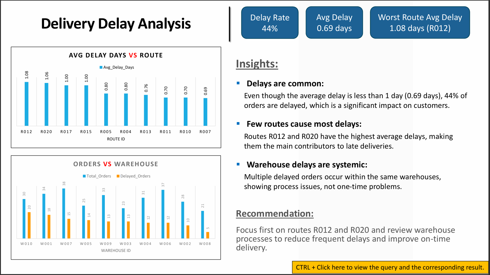
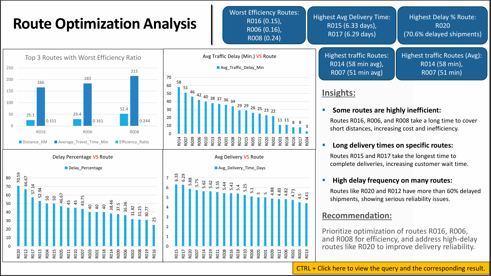
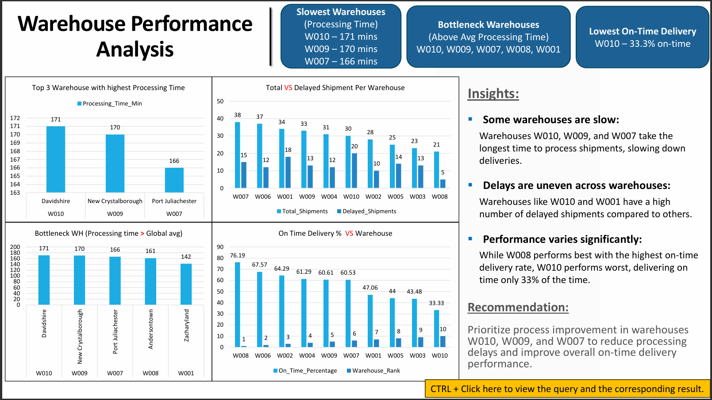
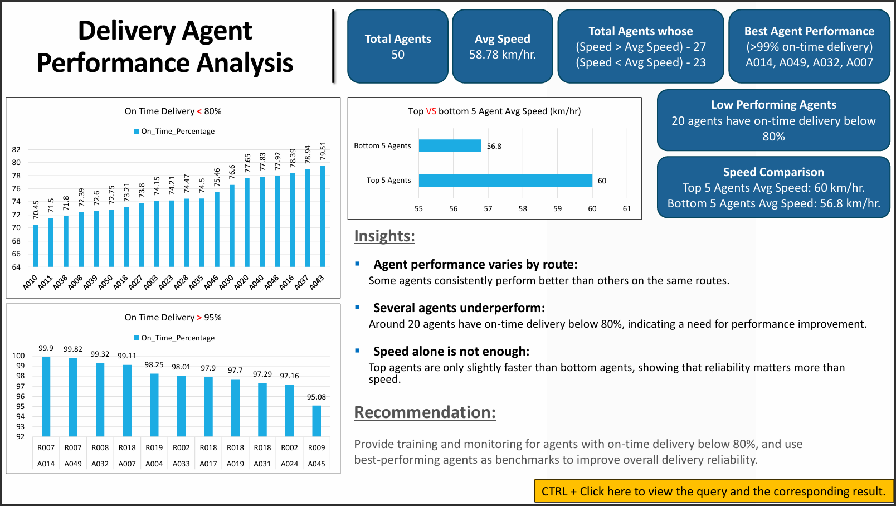
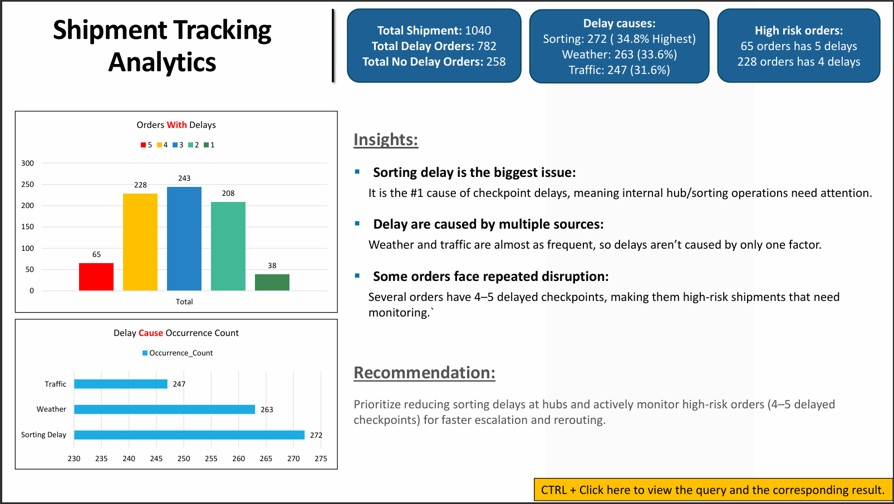
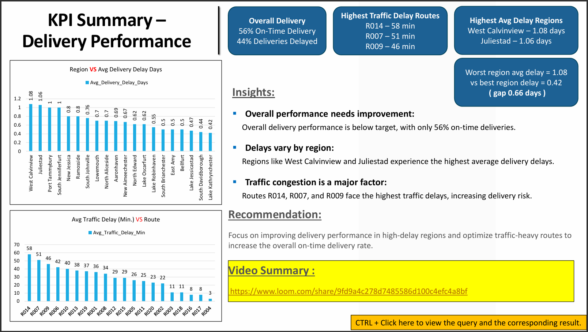

# UPS Logistics Optimization – SQL Data Analysis Project

## Project Overview

This project focuses on analyzing delivery performance for a UPS-style logistics operation using SQL.

The main objective of this project is to identify delivery delays, inefficient routes, warehouse bottlenecks, delivery agent performance issues, and shipment tracking problems.

The analysis was performed using SQL, and the final findings were presented using charts, KPIs, and business recommendations.

---

## Business Problem

Logistics companies handle many orders, routes, warehouses, agents, and shipment checkpoints every day.

Delays can happen due to:
- Inefficient delivery routes
- Warehouse processing delays
- Traffic issues
- Sorting delays
- Delivery agent performance issues

This project uses SQL to answer important business questions such as:

- Which routes have the highest delivery delays?
- Which warehouses are creating bottlenecks?
- Which delivery agents need performance improvement?
- What are the major shipment delay reasons?
- How can overall on-time delivery be improved?

---

## Tools Used

- **MySQL Workbench** – SQL querying and analysis
- **Excel** – Supporting charts and result tables
- **PowerPoint** – Final business presentation
- **Loom** – Project explanation video
- **GitHub** – Project hosting and portfolio publishing

---

## Skills Demonstrated

- SQL data cleaning
- SQL joins
- Aggregations
- Window functions
- CTEs
- KPI reporting
- Business analysis
- Data storytelling
- Dashboard-style presentation
- Insight generation
- Recommendation building

---

## Dataset Tables

The project uses 5 datasets:

1. **Orders**
   - Contains order details, route ID, warehouse ID, order date, expected delivery date, actual delivery date, and delivery status.

2. **Routes**
   - Contains route-level details such as start location, end location, distance, average travel time, and traffic delay.

3. **Warehouses**
   - Contains warehouse location, processing time, and dispatch time.

4. **Delivery Agents**
   - Contains delivery agent performance details such as route assignment, shift hours, average speed, and on-time percentage.

5. **Shipment Tracking**
   - Contains checkpoint-level shipment tracking data and delay reasons.

---

## Project Workflow

### 1. Data Cleaning & Preparation
- Checked duplicate Order IDs
- Checked missing traffic delay values
- Converted date columns from text format to DATE format
- Validated delivery dates
- Confirmed that the dataset was ready for analysis

### 2. Delivery Delay Analysis
- Calculated delivery delay in days for each order
- Found top delayed routes based on average delay days
- Ranked orders by delay within each warehouse



### 3. Route Optimization Insights
- Calculated average delivery time per route
- Calculated average traffic delay per route
- Calculated distance-to-time efficiency ratio
- Identified routes with poor efficiency
- Recommended routes for optimization



### 4. Warehouse Performance Analysis
- Found warehouses with highest processing time
- Compared total shipments vs delayed shipments
- Identified bottleneck warehouses using CTEs
- Ranked warehouses by on-time delivery percentage



### 5. Delivery Agent Performance
- Ranked delivery agents by on-time delivery percentage per route
- Identified agents with on-time delivery below 80%
- Compared average speed of top 5 and bottom 5 agents



### 6. Shipment Tracking Analytics
- Found last checkpoint and checkpoint time for each order
- Identified most common delay reasons
- Found high-risk orders with more than 2 delayed checkpoints



### 7. Advanced KPI Reporting
- Calculated average delivery delay by region
- Calculated overall on-time delivery percentage
- Calculated average traffic delay by route



---

## Key Insights

- **44% of deliveries were delayed**, showing that delivery delays are a major operational issue.
- **Overall on-time delivery was 56%**, which indicates room for service improvement.
- Routes **R012 and R020** had high average delivery delays.
- Routes **R016, R006, and R008** were identified as inefficient routes.
- Warehouse **W010** had the lowest on-time delivery performance.
- **Sorting Delay** was the most common shipment delay reason.
- **20 delivery agents** had on-time delivery below 80%.
- Agent speed alone did not guarantee better on-time delivery.
- Some orders had repeated delayed checkpoints, making them high-risk shipments.

---

## Recommendations

- Optimize high-delay routes such as **R012 and R020**.
- Improve inefficient routes such as **R016, R006, and R008**.
- Improve warehouse processing at bottleneck warehouses, especially **W010, W009, and W007**.
- Train and monitor agents with on-time delivery below 80%.
- Reduce sorting delays at hubs.
- Monitor high-risk orders with repeated delayed checkpoints.
- Focus on high-delay regions and traffic-heavy routes to improve overall on-time delivery.

---

## Project Files

```
UPS-Logistics-SQL-Analysis/
│
├── README.md
├── .gitignore
│
├── Data/
│   ├── Orders.csv
│   ├── Routes.csv
│   ├── Warehouses.csv
│   ├── DeliveryAgents.csv
│   └── Shipment_Tracking_Table.csv
│
├── SQL/
│   └── UPS_Logistics_Analysis.sql
│
├── Presentation/
│   ├── UPS_Final_Presentation.pdf
│   └── UPS_Final_Presentation.pptx
│
├── Screenshots/
│   ├── delivery_delay_analysis.png
│   ├── route_optimization_analysis.png
│   ├── warehouse_performance_analysis.png
│   ├── delivery_agent_performance_analysis.png
│   ├── shipment_tracking_analysis.png
│   └── kpi_summary.png
│
└── Support_Files/
    └── Support_Table_and_Charts.xlsx
```
---

## Project Explanation Video

Watch the full project explanation video here:

https://www.loom.com/share/9fd9a4c278d7485586d100c4efc4a8bf

---

## Project Outcome

This project demonstrates end-to-end SQL analytics skills by converting raw logistics data into business insights and actionable recommendations.

It shows how SQL can be used to improve delivery performance, identify operational bottlenecks, and support better logistics decision-making.

---

## Author

**Dheeraj Marmat**  
Data Analyst Portfolio Project